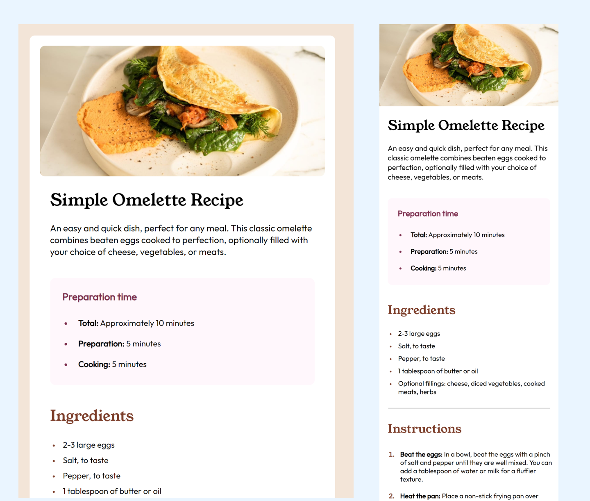

# Frontend Mentor - Recipe page solution

This is a solution to the [Recipe page challenge on Frontend Mentor](https://www.frontendmentor.io/challenges/recipe-page-KiTsR8QQKm). Frontend Mentor challenges help you improve your coding skills by building realistic projects. 

## Table of contents

- [Overview](#overview)
  - [The challenge](#the-challenge)
  - [Screenshot](#screenshot)
  - [Links](#links)
- [My process](#my-process)
  - [Built with](#built-with)
  - [What I learned](#what-i-learned)
  - [Continued development](#continued-development)
  - [Useful resources](#useful-resources)
- [Author](#author)


## Overview

### The Challenge
Recipe page
This challenge will help you focus on writing semantic HTML. Ensure you think through what HTML elements are most appropriate for each piece of content.


### Screenshot of the solution





### Links

- Solution URL: https://ritakerkovits.github.io/recipe-page-main/
  

## My process


### Built with

- Semantic HTML5 markup
- CSS custom properties
- Flexbox
- Mobile-first workflow


### What I learned

Discovered the **li::marker pseudo-element** in CSS.
It allowed precise customization of list markers, enhancing the visual appeal of lists on the website.

The code I used:
```css
.ingredients li::marker{
  color: #7B3C28;
  font-size: 0.8rem ;
}
```

Utilised the **:nth-child selector** for a table.

The code I used:
```css
tr:first-child{
  border-top:none ;
}

tr:last-child{
  border-bottom:none ;
}

```


### Continued development

In upcoming projects, I intend to sharpen my proficiency in **Flexbox**. While I've utilized this layout technique effectively, I aim to dig deeper into its advanced features.
Also I would like to apply the **CSS Grid** techniques as well in these kind of projects.

Besides improving my proficiency in **Flexbox and CSS Grid**, I'm also looking to enhance the **HTML structures** in my projects.  I want to make sure my HTML is not just functional but also easy to understand and work with, following best practices.


### Useful resources

- **CSS pseudo-element** -  _https://developer.mozilla.org/en-US/docs/Web/CSS/::marker_ - This helped me to select and format the list marker. This website provides a lot of other helpful tools.
- **Flexbox solutions** - _https://developer.mozilla.org/en-US/docs/Web/CSS/flex_ and _https://css-tricks.com/snippets/css/a-guide-to-flexbox/_ - These articles supplemented and helped to enhance the responsive web design using Flexbox.
- **Formatting the borders of the table** - _https://discuss.codecademy.com/t/setting-a-border-for-one-or-two-sides-of-the-element/365302_ - This helped me to set only the top and the bottom borders for each row in the table
- **Selecting the child element in a table** - _https://www.thoughtco.com/add-internal-lines-to-table-with-css-34_69872 - This helped me to select each child element in a table

## Author

- Website - Rita Kerkovits
- Frontend Mentor - ritakerkovits _https://www.frontendmentor.io/profile/ritakerkovits_

